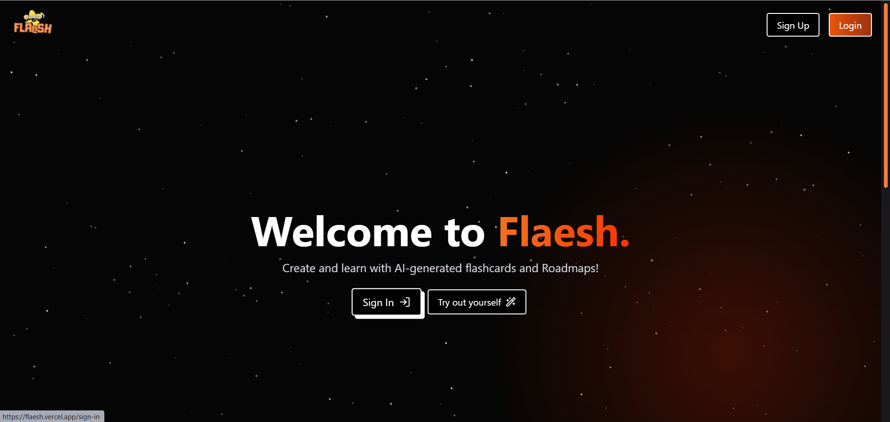
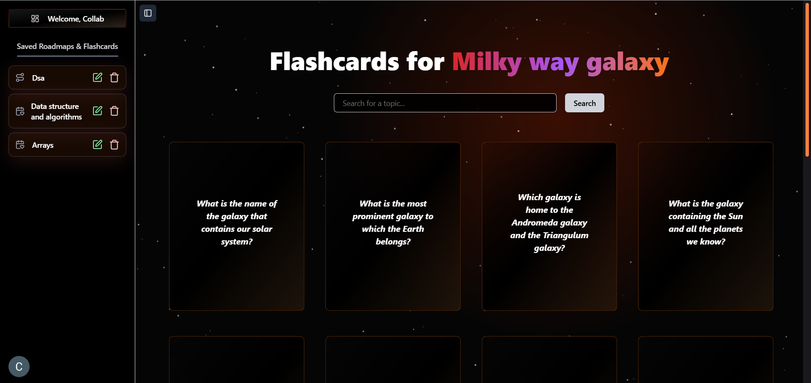
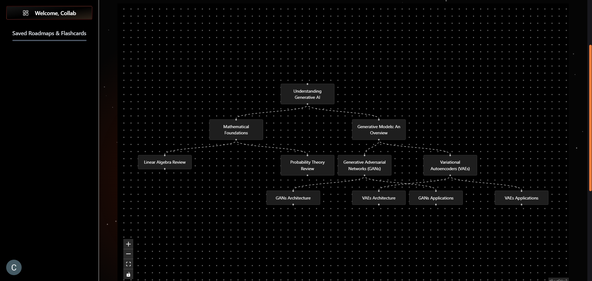
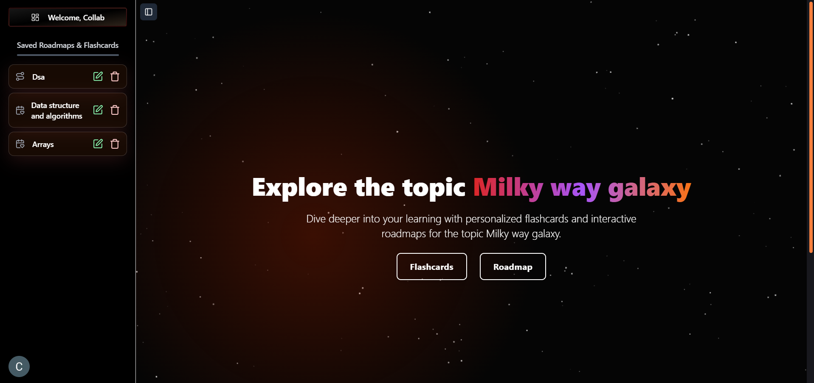
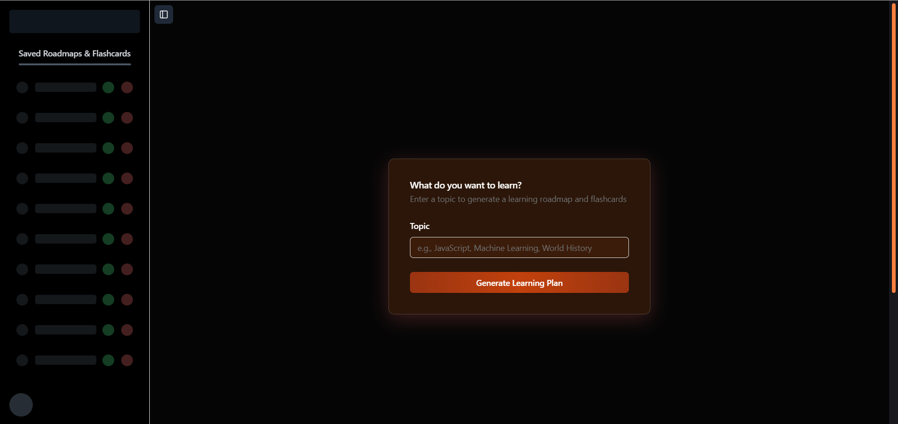

# Flashcard Roadmap SaaS Application

Welcome to the **[Flaesh](https://flaesh.vercel.app/)**, a comprehensive tool for learning and planning success! This application combines interactive flashcards with visually appealing roadmaps to help users master new topics and stay organized. Whether you're a student, professional, or lifelong learner, this app is designed to enhance your knowledge retention and streamline your learning journey.

**Link**: [https://flaesh.vercel.app/](https://flaesh.vercel.app/)

## **Key Features**

### Design

- **Dark Theme:** A sleek, modern dark theme for reduced eye strain and enhanced visual appeal.
- **Animation:** Simple and smooth animations
- **Responsive Layout:** Fully responsive design that looks great on any device.
  

### Flashcards

- **Create and Manage Flashcards:** Effortlessly create, edit, and delete flashcards for different topics.
- **Organized Study:** Flashcards are categorized into topics, making it easy to focus on specific areas.
- **Cached Data:** Previously viewed flashcards are cached for instant access.
- **Loading Skeleton:** For better User Experience
  

### Roadmaps

- **Interactive Roadmaps:** Visualize your learning path with interactive and editable roadmaps.
- **Topic Focus:** Dive deep into specific topics by selecting a roadmap.
- **Description:** Get timeline, brief description and instant flashcards for roadmap topics
- **Cached Roadmap Data:** Quickly revisit previously explored roadmaps without additional loading.
  

### Collaborative Sidebar

- **Dynamic Sidebar:** View your saved flashcards and roadmaps in a collapsible sidebar.
- **Quick Access:** Easily navigate between topics with the intuitive interface.
- **Responsive Design:** The sidebar adjusts dynamically for desktop and mobile users.
  

### User-Friendly Navigation

- **Toggle Sidebar:** Open or close the sidebar as needed to focus on your content.
- **Seamless Transitions:** Enjoy smooth animations for an engaging user experience.
  

### Backend Efficiency

- **API-Driven Architecture:** Leverages a robust backend API to fetch, edit, and delete flashcards and roadmaps.
- **Error Handling:** Ensures consistent performance and helpful error messages.
- **Toast message:** Ensures Better UX

  

## **Tech Stack**

### Frontend

- **Next.js**
- **Tailwind CSS**
- **ShadCN**
- **Framer Motion**
- **React Flow**:

### Backend

- **Node.js**
- **REST APIs**
- **Supabase**
- **Prisma**
- **PostgreSQL**
- **NGINX**
- **Groq**

### Database

- **Supabase/PostgreSQL**

### Authentication

- **Clerk**

### Dev Tools

- **NGINX (Local Development)**
- **Postman**
- **Vercel**

## **Getting Started**

Follow these steps to get the app running on your local machine.

### Prerequisites

Ensure you have the following installed:

- **Node.js**:
- **Postgres**:
- **npm or yarn**:
- **nginx**

### Installation

1. **Clone the repository:**

   ```bash
   git clone https://github.com/c4dr-me/Flaesh.git
   cd flaesh
   ```

2. **Install dependencies:**

   ```bash
   npm install
   ```

3. **Set up environment variables:**
   Create a `.env.local` file in the root directory and `.env` for prisma and add:

   ```env
    DATABASE_URL=
    DIRECT_URL= (needed for supabase if testing locally with postgres then not needed)
    NEXTAUTH_URL=

    NEXT_PUBLIC_CLERK_SIGN_IN_URL=/sign-in
    NEXT_PUBLIC_CLERK_SIGN_UP_URL=/sign-up
    NEXT_PUBLIC_CLERK_SIGN_IN_FORCE_REDIRECT_URL=/dashboard
    NEXT_PUBLIC_CLERK_SIGN_UP_FORCE_REDIRECT_URL=/
    NEXT_PUBLIC_CLERK_PUBLISHABLE_KEY=
    CLERK_SECRET_KEY=
    CLERK_FRONTEND_API=
    SIGNING_SECRET=

    GROQ_API_KEY=
   ```

4. **Run the app:**

   ```bash
   npm run dev
   ```

5. Open your browser and navigate to `http://localhost:3000`.

6. While deploying make sure to add the build script on Vercel as `npx prisma generate && next build`.

## **Contributing**

We welcome contributions to improve this app! To contribute:

1. Fork the repository.
2. Create a new branch (`feature/your-feature`).
3. Commit your changes (`git commit -m "Add a new feature"`).
4. Push to the branch (`git push origin feature/your-feature`).
5. Open a pull request.

## **Future Enhancements**

### Planned Features:

- **Quiz App:** Short quiz based on the flashcard/roadmap.
- **Export Options:** Export roadmaps and flashcards to PDF or Excel.

## **License**

This project is licensed under the MIT License. See the [LICENSE](./LICENSE) file for details.

## **Contact**

- Contact at **jayant_cse_26@msit.in**.
